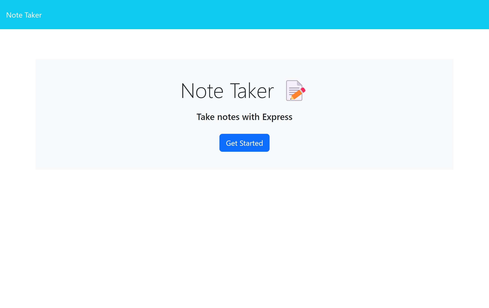
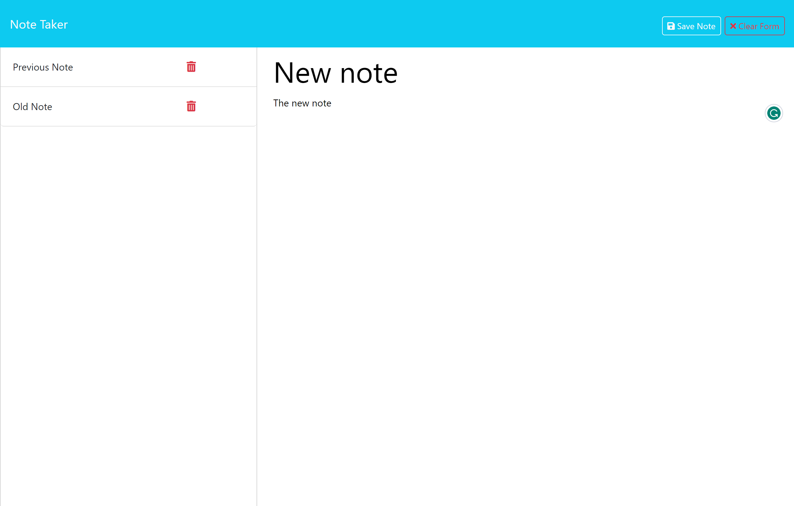
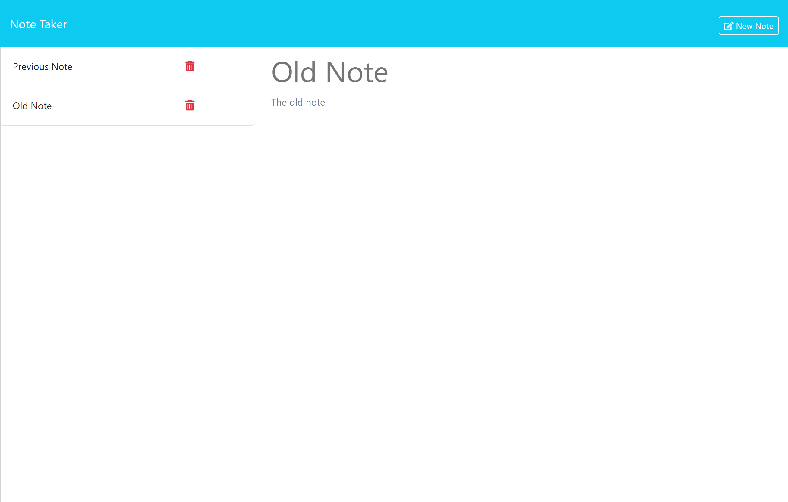
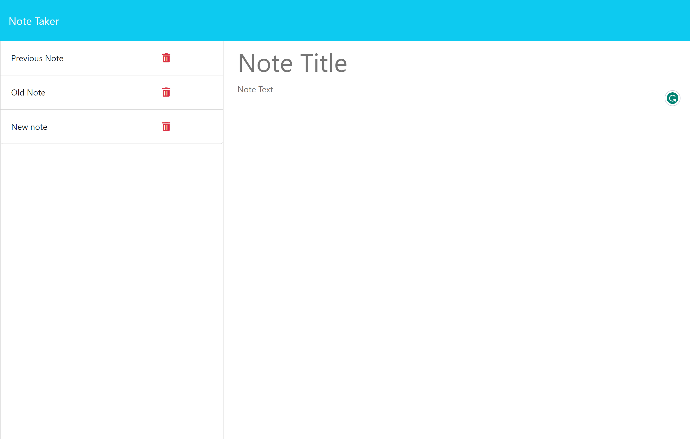
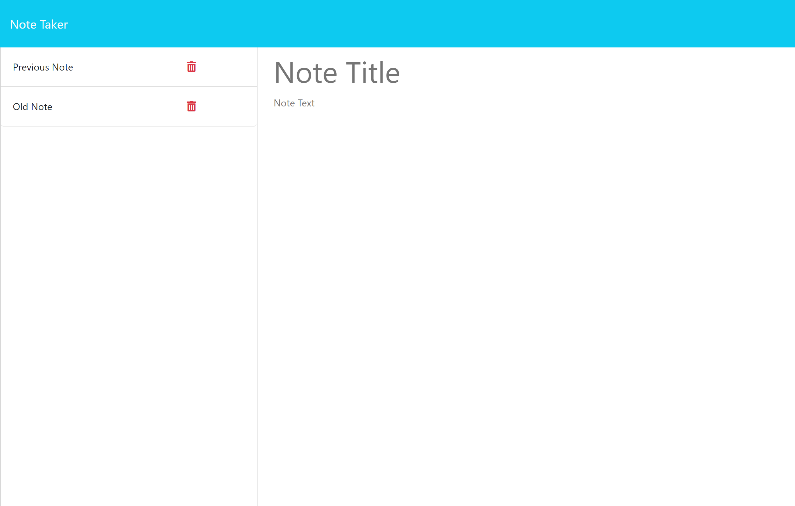

# Note Taker

## Description
To test my newly adquired Express knowledge I took on the endevour of building this note taking app, it will keep all your notes handy and safe in the server until you need them again and you can add and delete notes as you need,  I really put all the new knowledge together to make this one happen

## Table of Contents

- [Installation](#installation)
- [Usage](#usage)
- [Questions](#questions)
- [Credits](#credits)
- [Releases](#Releases)

## Installation

No installation needed

## Usage
When the page loads your are presented with the landing page, click the main button to go to the notes page

In the notes page you can add new notes in the boxes on the right and on the left you have a list with all previous notes 

If you click the note title you can open that note

If you click the delete button it will deleted that note (this action is permanent, be careful)

## Credits

## Tests
No test at the moment

## Questions
For questions contact me at [Github](https://github.com/venecoderr) or [Email me](mailto:josefrm.55@gmail.com)

## Releases

You can find the lastest version of the app at: 
